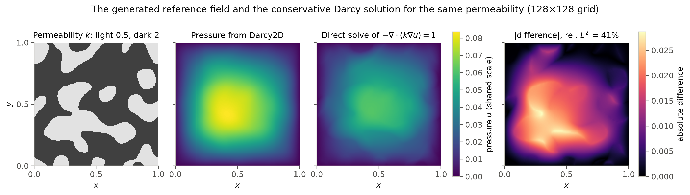
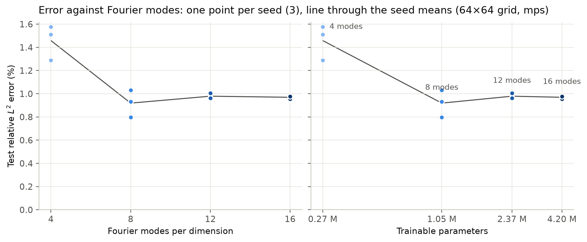
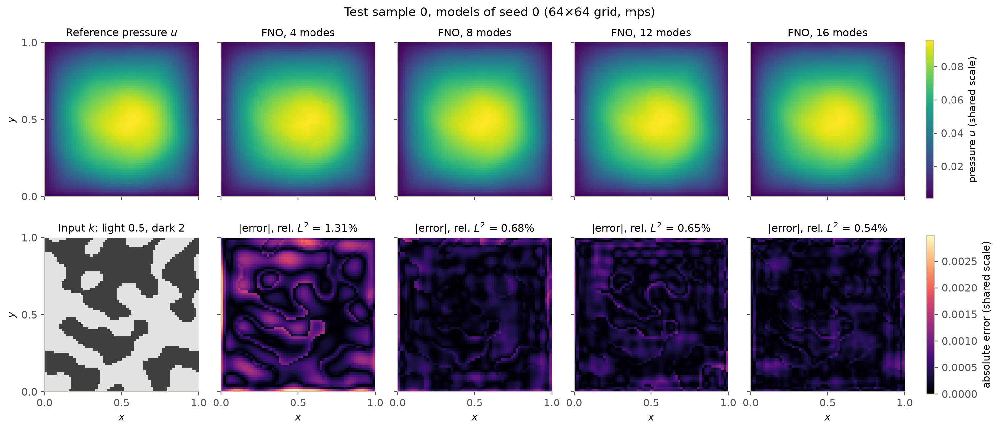
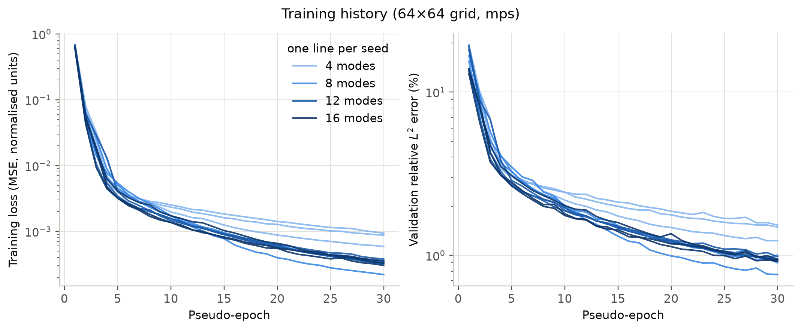
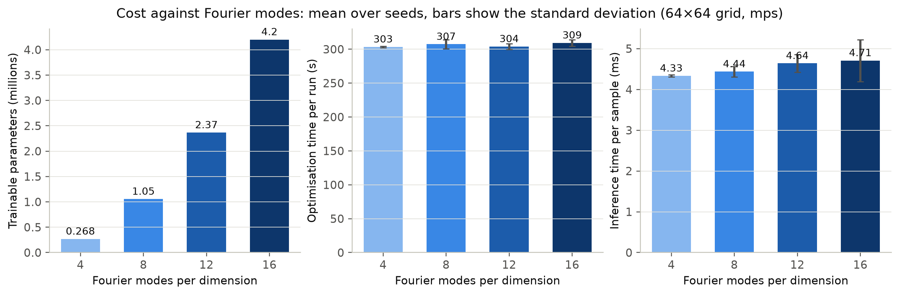

# Fourier-Mode Capacity of an FNO Surrogate for the PhysicsNeMo Darcy Benchmark

A parameter study built on the Fourier Neural Operator (FNO) Darcy-flow example of [NVIDIA PhysicsNeMo](https://github.com/NVIDIA/physicsnemo). The FNO model, the data generator and the training utilities are PhysicsNeMo's. This repository adds a controlled experiment around them: the number of retained Fourier modes is varied, every model is trained on the same data and evaluated on the same held-out set, and accuracy and cost are recorded per run.

**Question.** How does the Fourier representation, and with it the model capacity, affect the accuracy and the computational cost of an FNO surrogate for Darcy flow?

## Status of the results

| Study | Configuration | Data generator | Device | Status |
|---|---|---|---|---|
| Reduced study, 64 × 64 | `configs/local.yaml` | `IndependentDarcy2D` | Apple MPS | **run**; all numbers in [Results](#results) come from it |
| Generator checks | `scripts/verify_generator.py` | both | CPU | **run** |
| Generator checks | `scripts/verify_generator.py --device cuda` | both | CUDA | pending |
| Main study, 256 × 256 | `configs/full.yaml` | `IndependentDarcy2D` | CUDA | pending |
| Upstream-behaviour control | `configs/official.yaml` | `Darcy2D` as shipped | CUDA | pending |

No CUDA result of any kind is reported in this repository yet.

## Motivation

A neural operator learns the map from a coefficient field to the solution of a PDE, so that a new coefficient field is solved by one forward pass. In an FNO each layer applies a learned linear operator to the lowest Fourier modes of its input and discards the rest. The number of retained modes is therefore the main capacity setting of the architecture: it fixes the spatial scales the spectral layers can act on, and the parameter count grows with its square. The Darcy problem with a piecewise-constant permeability is a common test because the input is discontinuous while the solution is smooth.

## Governing PDE

The benchmark is posed as steady Darcy flow on the unit square with constant forcing and homogeneous Dirichlet boundary conditions:

$$-\nabla\cdot\bigl(k(x)\,\nabla u(x)\bigr) = 1 \quad \text{in } \Omega = (0,1)^2, \qquad u = 0 \quad \text{on } \partial\Omega,$$

with permeability $k$ taking the values 0.5 and 2 and pressure $u$. The operator to learn is $k \mapsto u$.

The reference fields come from PhysicsNeMo's `Darcy2D` generator, which solves a discretisation of the non-conservative form $k\,\Delta u + \nabla k\cdot\nabla u + 1 = 0$. The stencil it iterates does not converge to the equation above for discontinuous $k$; see [Dataset](#dataset). The solver is used unchanged. **The learning target in this repository is therefore NVIDIA's discrete operator, the map from $k$ to the output of `Darcy2D`'s solver, and not the conservative discretisation of $-\nabla\cdot(k\nabla u) = 1$.**

## Model

`physicsnemo.models.fno.FNO` with the settings of the NVIDIA example: 2D, one input channel, latent width 32, four spectral layers, domain padding 9, coordinate features, and a one-layer decoder of width 32. Only `num_fno_modes` is varied.

## Original NVIDIA example

| | |
|---|---|
| Example | [`examples/cfd/darcy_fno`](https://github.com/NVIDIA/physicsnemo/tree/b45a5c810c741e6b41f8515be24c51121f8fc21f/examples/cfd/darcy_fno) (`train_fno_darcy.py`, `config.yaml`, `validator.py`) |
| PhysicsNeMo commit | `b45a5c810c741e6b41f8515be24c51121f8fc21f` (main branch, 2 October 2026, version `2.3.0a0`) |
| Licence | Apache-2.0 |

The original trains one FNO with 12 modes on a 256 × 256 grid. Data are generated during training: every batch of 64 is a new call to `Darcy2D`, for 256 pseudo-epochs of 2048 samples each. The loss is the mean squared error of the normalised pressure, the optimiser is Adam with a learning rate of $10^{-3}$ multiplied by 0.85 every 8 pseudo-epochs, and validation uses 256 further generated samples.

### Upstream version

PhysicsNeMo is pinned to a commit of the main branch and not to the 2.2.2 release on PyPI. With the 2.2.2 wheel, `Darcy2D` on CPU (macOS arm64, Warp 1.18.0) returned NaN pressure fields at resolutions 64, 128 and 256. The multigrid upsampling kernel was corrected on the main branch after that release, and the pinned commit returns finite fields at all of these resolutions.

## What this repository changes

Original NVIDIA implementation, used through the installed package and not copied:

- the FNO architecture (`physicsnemo.models.fno.FNO`);
- the `Darcy2D` generator and its Warp kernels (permeability synthesis, thresholding, multigrid Jacobi solver);
- `StaticCaptureTraining`, `StaticCaptureEvaluateNoGrad`, `save_checkpoint`, `load_checkpoint`.

Adapted from the NVIDIA example, with the NVIDIA licence header kept and the changes stated in each file:

- `configs/official.yaml`: the upstream `config.yaml` with its keys and values unchanged, and added keys below a marker;
- `src/fno_darcy/model.py`: the FNO construction, with the number of modes as an argument;
- `src/fno_darcy/engine.py`: the training loop (loss, optimiser, learning-rate schedule, checkpoints);
- `src/fno_darcy/data.py`: `IndependentDarcy2D.initialize_batch`, from `Darcy2D.initialize_batch`.

Extensions and experiments in this repository:

1. **Fourier-mode study.** `num_fno_modes` ∈ {4, 8, 12, 16}, three seeds each, everything else fixed.
2. **Finite, shared datasets.** With `data.source: fixed` the training, validation and test sets are generated once from fixed seeds and cached, so all models see identical data. The upstream streaming protocol remains available as `data.source: stream`.
3. **Independent samples.** `IndependentDarcy2D` replaces the random draw of the Fourier coefficients (see [Dataset](#dataset)). The upstream draw remains available as `data.independent_samples: false`.
4. **Tighter reference solver tolerance** in the study configurations ($10^{-7}$ in place of the default $10^{-6}$).
5. **Evaluation.** Relative $L^2$ error in physical units on a fixed test set, parameter count, synchronised training and inference times, CUDA peak memory, and a record of the environment for every study.
6. **Generator checks.** `scripts/verify_generator.py` compares the generated fields with independent sparse direct solves.
7. **Explicit device.** The original constructs `Darcy2D` with its default device `"cuda"`. Here the device is a configuration key, so the pipeline also runs on CPU and Apple MPS (Warp generates on CPU in the MPS case).

### Two data generators

The repository contains two samplers of the permeability field. They share the upstream solver and differ only in how the Fourier coefficients are drawn.

| | `Darcy2D` | `IndependentDarcy2D` |
|---|---|---|
| Origin | PhysicsNeMo, unmodified | this repository, a subclass of `Darcy2D` overriding `initialize_batch` |
| Coefficient draw | Warp kernel `init_uniform_random_4d` | `numpy.random.uniform(-1, 1)` |
| Distinct fields in a batch (CPU) | 1 | all |
| Solver | upstream multigrid Jacobi | the same upstream multigrid Jacobi |
| Selected by | `data.independent_samples: false` | `data.independent_samples: true` |
| Used in | `configs/official.yaml` (control) | `configs/smoke.yaml`, `configs/local.yaml`, `configs/full.yaml` (the study) |

`configs/official.yaml` is the control for upstream behaviour: upstream architecture, schedule, streaming data, default solver tolerance and the unmodified `Darcy2D`. It is kept free of this repository's changes to the data so that a run of it reproduces what the NVIDIA example trains on. Every study writes the name of its generator to `study_metadata.json` and `summary.json` (`data_generator`) and to each dataset record (`generator`, `independent_samples`, `distinct_permeability_fields`).

Not carried over from the original: the `LaunchLogger` and MLFlow logging, the validation figure of `validator.py`, and resumption from a checkpoint inside a run.

## Dataset

No external dataset is used. `Darcy2D` draws Fourier coefficients on $[-1, 1]$, sums a 5 × 5 sine and cosine series, thresholds it at zero to obtain $k \in \{0.5, 2\}$, and solves for $u$ with a multigrid Jacobi iteration written in NVIDIA Warp. Inputs and outputs are normalised with the constants of the upstream configuration.

`scripts/verify_generator.py` checks the generator at the pinned commit. Its output is in [`results/generator_check.json`](results/generator_check.json). Three properties matter for reading the results.

**1. Sample diversity.** The upstream kernel `init_uniform_random_4d` seeds the generator of every coefficient with `wp.rand_init(seed, wp.tid())` inside a four-dimensional launch. Measured on CPU:

| Generator | Distinct fields in a batch of 16 | Distinct coefficient values per batch |
|---|---|---|
| `Darcy2D` as shipped | 1 | 4 of 1600 |
| `IndependentDarcy2D` (this repository) | 16 | 1600 of 1600 |

As shipped, all samples of a batch are the same field, and all frequencies of a sample share one amplitude per trigonometric component. The same four-of-many pattern was reproduced with a standalone kernel on Warp 1.5.1, 1.10.1, 1.14.0, 1.16.0, 1.17.0 and 1.18.0 on CPU. **It has not been tested on CUDA.** Whether the Warp CUDA backend behaves the same way is the first step of the GPU workflow below (`scripts/verify_generator.py --device cuda`), and the statements in this section hold for CPU until that check is recorded. `IndependentDarcy2D` draws the coefficients from NumPy with the same range and leaves the synthesis, the thresholding and the solver to the upstream kernels. All studies in this repository use it; `configs/official.yaml` keeps the upstream behaviour.

**2. Solver tolerance.** The Jacobi iteration stops when the largest update falls below `convergence_threshold`. The table gives the relative $L^2$ difference between the generated pressure and a sparse direct solve of the same stencil (mean of 4 samples):

| Grid | Tolerance $10^{-6}$ (default) | Tolerance $10^{-7}$ |
|---|---|---|
| 64 × 64 | 0.42% | 0.045% |
| 128 × 128 | 0.27% | 0.16% |
| 256 × 256 | 1.3% | 0.17% |

At 256 × 256 the default tolerance leaves an iteration error of the same size as the error of a trained FNO, so the study configurations use $10^{-7}$.

**3. The equation that is solved.** The Jacobi kernel scales the term $\nabla k\cdot\nabla u$ as $(\delta k\,\delta u)/(2\,\Delta x)$, with $\delta$ the difference of the two neighbouring nodes. A product of two central differences is $(\delta k\,\delta u)/(4\,\Delta x^2)$. The term is therefore weighted by a factor $2\,\Delta x$ relative to a consistent discretisation, and its weight vanishes under refinement. Relative $L^2$ difference between the generated pressure (tolerance $10^{-7}$) and direct solves of three discrete problems:

| Grid | Kernel stencil | Conservative $-\nabla\cdot(k\nabla u) = 1$ | $k\,\Delta u = -1$ |
|---|---|---|---|
| 64 × 64 | 0.045% | 32% | 1.6% |
| 128 × 128 | 0.16% | 33% | 1.0% |
| 256 × 256 | 0.17% | 34% | 0.50% |

The generated fields solve the kernel's stencil, differ from the conservative Darcy solution by about a third in relative $L^2$ at every resolution, and approach the solution of $k\,\Delta u = -1$ as the grid is refined. The conservative reference uses a five-point flux form with harmonic face permeabilities.



*One permeability field at 128 × 128. The two pressure fields share a colour scale.*

The reference data of this benchmark are therefore the output of a specific discrete operator and not a solution of the Darcy equation in divergence form. The solver is deliberately left as NVIDIA ships it, because the subject of this repository is the official example. This does not affect the comparison between models, which are all trained and tested on the same operator, but the errors reported below are errors against the generator and not against Darcy flow.

## Experimental design

One factor is varied: the number of Fourier modes per dimension, 4, 8, 12 and 16 (12 is the upstream value). Each setting is trained with seeds 0, 1 and 2. A seed fixes the weight initialisation and the order of the training batches; the datasets are the same for all runs.

| | `smoke` | `local` | `full` | `official` |
|---|---|---|---|---|
| Purpose | pipeline check | reduced study | study at upstream resolution | upstream settings |
| Grid | 32 × 32 | 64 × 64 | 256 × 256 | 256 × 256 |
| Fourier modes | 4, 8 | 4, 8, 12, 16 | 4, 8, 12, 16 | 12 |
| Seeds | 1 | 3 | 3 | 1 |
| Latent width | 8 | 32 | 32 | 32 |
| Training data | 32 fixed | 1024 fixed | 4096 fixed | stream, 2048 new per pseudo-epoch |
| Pseudo-epochs | 2 | 30 | 60 | 256 |
| Batch size | 8 | 32 | 64 | 64 |
| Learning-rate decay | every 1 | every 3 | every 4 | every 8 |
| Validation / test samples | 16 / 16 | 128 / 256 | 256 / 512 | 256 / 256 |
| Solver tolerance | $10^{-6}$ | $10^{-7}$ | $10^{-7}$ | $10^{-6}$ |
| Sampler | independent | independent | independent | as shipped |
| Device | CPU | CUDA, MPS or CPU | CUDA | CUDA |
| Run in this repository | yes | yes | no | no |

The largest admissible number of modes is $\lfloor (N + 9)/2 \rfloor + 1$ for an $N \times N$ grid with padding 9; a study that exceeds it is rejected before training.

Metrics per run: training loss per pseudo-epoch, validation loss and validation relative $L^2$ error, test relative $L^2$ error

$$\varepsilon = \frac{\lVert \hat u - u \rVert_2}{\lVert u \rVert_2}$$

per sample in physical units (mean, standard deviation, median and maximum over the test set), trainable parameters, wall-clock training time split into optimisation and data time, inference time of one batch (median of 30 forward passes after 5 warm-up passes), and CUDA peak memory. All timers synchronise the device before reading the clock.

## Installation

Python 3.11 to 3.14.

```bash
python -m venv .venv
source .venv/bin/activate
pip install -r requirements.txt
```

`requirements.txt` installs PhysicsNeMo from the pinned commit, with PyTorch, NVIDIA Warp, Hydra, SciPy, Matplotlib and pytest. Training on the 256 × 256 configurations needs a CUDA GPU. The smoke and local configurations run on a laptop.

## Smoke test

```bash
python -m pytest -q
python scripts/train.py --config smoke
python scripts/plot_results.py --study runs/smoke --out runs/smoke/figures
```

The smoke study trains two small models for two pseudo-epochs on a 32 × 32 grid and takes a few seconds on a CPU. Its numbers are not results. Arguments after the options are Hydra overrides of the configuration, for example `python scripts/train.py --config smoke device=mps training.max_pseudo_epochs=4`.

## Full training

Reduced study, on a laptop (about 65 minutes for the 12 runs on an Apple M3 Pro with MPS, plus about 5 minutes of data generation):

```bash
python scripts/train.py --config local
```

Study at the upstream resolution and the upstream settings, on a CUDA GPU:

```bash
python scripts/train.py --config full
python scripts/train.py --config official
```

`--resume` skips runs that already finished. Neither of the two CUDA configurations has been run for this repository.

### GPU workflow on Kaggle

[`kaggle/run_cuda.ipynb`](kaggle/run_cuda.ipynb) is a launcher: it checks out one commit of this repository and calls its scripts. It contains no model or training code. It has been checked statically (`tests/test_notebook.py`) and has not been executed on Kaggle.

1. Create a Kaggle notebook from `kaggle/run_cuda.ipynb`. Session options: **Accelerator** an NVIDIA GPU, **Internet** on.
2. In the first code cell set `REF` to the full 40-character SHA of the commit to run (`git rev-parse HEAD`). Branch and tag names are refused. The notebook checks that the checked-out commit is `REF` and that the tree is clean. For a private repository, store a GitHub token as a Kaggle secret and put the name of the secret in `GITHUB_TOKEN_SECRET`.
3. Set `SESSION_BUDGET_HOURS` to the GPU time available for the session, and `RUN_FULL` and `RUN_OFFICIAL` as needed.
4. Run all.

| Step | Command run by the notebook | Runs when | Output in `/kaggle/working` |
|---|---|---|---|
| A | `python scripts/verify_generator.py --device cuda` | always, before any training | `physicsnemo-fno-darcy-generator-check-cuda.zip` |
| | `python -m pytest -q`, a CUDA smoke study, a one-pseudo-epoch timing probe | always | |
| B | `python scripts/train.py --config full --resume` | `RUN_FULL = True` | `physicsnemo-fno-darcy-full.zip`, `physicsnemo-fno-darcy-full-eval-bundle.zip` |
| C | `python scripts/train.py --config official --resume` | `RUN_OFFICIAL = True`, after B has completed | `physicsnemo-fno-darcy-official.zip`, `physicsnemo-fno-darcy-official-eval-bundle.zip` |

Step A records the GPU model and the CUDA, Warp, PyTorch and PhysicsNeMo versions together with the sample-diversity and stencil checks, and prints whether the repeated-batch behaviour of `Darcy2D` is reproduced on CUDA. Its files are written outside the clone, so the studies record a clean tree.

Before B and before C the notebook projects the runtime from a one-pseudo-epoch probe and compares it with what is left of `SESSION_BUDGET_HOURS`. If the projection does not fit, the step is not started and the configuration is not reduced; the notebook prints the projection and finishes. With both flags `False`, the default, the notebook ends after the probe with `KAGGLE CUDA CHECKS COMPLETE. No full study was run.`

Each study produces two archives. `<name>.zip` holds the JSON and CSV records and the plotted fields that are tracked in `results/`. `<name>-eval-bundle.zip` holds the final checkpoint of every run and the validation and test sets generated on the GPU, and is not tracked; it allows the errors to be recomputed on another machine.

### Integrating GPU results

From the repository root, with the archives downloaded to `~/Downloads`:

```bash
unzip ~/Downloads/physicsnemo-fno-darcy-generator-check-cuda.zip -d .
cp ~/Downloads/physicsnemo-fno-darcy-full.zip runs/full.zip
python scripts/results.py publish runs/full.zip
unzip ~/Downloads/physicsnemo-fno-darcy-full-eval-bundle.zip -d .
unzip runs/full.zip -d runs
python scripts/evaluate.py --config full --verify device=mps data.generation_device=cuda
python scripts/plot_results.py --study results/full --out figures
python -m pytest -q
```

`--verify` recomputes the test error of every run from its checkpoint on the GPU-generated test set and compares it with the stored value. It writes nothing, so the timings and memory figures of the GPU run are kept. `data.generation_device=cuda` selects the datasets of the GPU run; if they are missing, the command stops and does not regenerate them on another device. Replace `device=mps` by `device=cpu` on a machine without MPS. The same commands with `official` in place of `full` integrate step C.

## Evaluation

`scripts/train.py` evaluates every run after training. The evaluation can be repeated from the checkpoints:

```bash
python scripts/evaluate.py --config local
python scripts/plot_results.py --study runs/local --out runs/local/figures
python scripts/verify_generator.py
```

`evaluate.py` writes `summary.csv`, `summary.json` and `fields.npz` to the study directory. With `--verify` it recomputes the test errors from the checkpoints, compares them with the stored values and writes nothing. [`results/README.md`](results/README.md) describes the files.

## Results

### Reduced study (run)

`configs/local.yaml`, data from `IndependentDarcy2D`: 64 × 64 grid, 1024 training samples, 30 pseudo-epochs (960 optimiser steps), 256 test samples, three seeds, Apple M3 Pro with MPS. Source: [`results/local/summary.csv`](results/local/summary.csv). Values are mean ± sample standard deviation over the three seeds.

| Fourier modes | Parameters | Test relative $L^2$ error | Range over seeds | Final training loss | Test MSE | Optimisation time | Inference per sample |
|---|---|---|---|---|---|---|---|
| 4 | 268 017 | 1.46% ± 0.15% | 1.29% to 1.58% | 8.0e-4 | 8.3e-4 | 303 ± 1 s | 4.33 ± 0.03 ms |
| 8 | 1 054 449 | 0.92% ± 0.12% | 0.80% to 1.03% | 3.0e-4 | 3.3e-4 | 307 ± 7 s | 4.44 ± 0.13 ms |
| 12 | 2 365 169 | 0.98% ± 0.02% | 0.96% to 1.01% | 3.4e-4 | 3.8e-4 | 304 ± 4 s | 4.64 ± 0.21 ms |
| 16 | 4 200 177 | 0.97% ± 0.01% | 0.96% to 0.98% | 3.3e-4 | 3.8e-4 | 309 ± 5 s | 4.71 ± 0.51 ms |

Losses are mean squared errors of the normalised pressure. Inference times are for a batch of 32 on MPS, divided by 32. The error of the reference solver at this resolution and tolerance is 0.045% (see [Dataset](#dataset)).

### Main study and upstream control (pending)

| Study | Test relative $L^2$ error | Timings and memory |
|---|---|---|
| `configs/full.yaml`, 256 × 256, modes 4, 8, 12, 16, three seeds, `IndependentDarcy2D`, CUDA | pending | pending |
| `configs/official.yaml`, 256 × 256, 12 modes, one seed, `Darcy2D` as shipped, CUDA | pending | pending |
| Generator checks on CUDA | pending | |

Neither study has been run. The reduced study is at a different resolution, data budget and device, and its numbers do not stand in for these.

## Figures

All figures are from the reduced study.



*Test relative $L^2$ error against the number of modes and against the parameter count. One point per seed.*



*One test sample, models of seed 0. Top: reference pressure and predictions on a shared colour scale. Bottom: permeability and absolute errors on a shared colour scale.*



*Training loss and validation error per pseudo-epoch, one line per run.*



*Parameter count, optimisation time and inference time against the number of modes.*

## Interpretation

These statements are for the reduced study only: one 64 × 64 grid, 1024 training samples and 960 optimiser steps.

- **Accuracy saturates at 8 modes.** Going from 4 to 8 modes lowers the test error from 1.46% to 0.92%, and the ranges over seeds do not overlap. Between 8, 12 and 16 modes the means differ by less than the spread over seeds at 8 modes.
- **More modes add parameters without adding accuracy here.** From 8 to 16 modes the parameter count grows by a factor of 4.0, from 1.05 to 4.20 million, with no measurable change of the error. The spectral weights account for nearly all parameters: each of the four layers holds $2 \times 32^2 \times m^2$ complex coefficients for $m$ modes.
- **Time does not depend on the number of modes at this size.** Optimisation time lies between 303 s and 309 s for all settings, within the spread over seeds. The cost of a step is set by the FFTs and pointwise layers on the padded 73 × 73 grid, and not by the size of the retained block. Inference time rises from 4.33 ms to 4.71 ms per sample, an increase smaller than the standard deviation of the 16-mode measurement. In this regime the cost of additional modes is memory for the weights, not time.
- **Seed sensitivity is larger for the small models.** The standard deviation over seeds is 0.12 to 0.15 percentage points for 4 and 8 modes and 0.01 to 0.02 for 12 and 16.
- **The generalisation gap is small.** The test MSE exceeds the final training loss by 3% to 16%, so the plateau is not explained by overfitting to the 1024 training samples.
- **Where the error is.** In the plotted sample the 4-mode model has its largest errors along the domain boundary and along the permeability interfaces; with 8 or more modes the error is lower everywhere and keeps a trace of the interfaces.

The validation error is still decreasing at the last pseudo-epoch for every setting, so the comparison is at a fixed training budget and not at convergence. Whether the larger models overtake the 8-mode model with more data or longer training is not answered by this study, and it is the question the 256 × 256 configuration is set up for.

## Limitations

- The reference data are the output of the `Darcy2D` generator, which does not solve the Darcy equation in divergence form (see [Dataset](#dataset)). The fields it produces are smooth across permeability interfaces, without the kinks of a flux-continuous solution. The number of modes needed for flux-continuous data may differ.
- Results exist only for the reduced study at 64 × 64. The upstream resolution and the upstream training protocol have not been run.
- The study and the upstream control use different samplers (`IndependentDarcy2D` and `Darcy2D`), data budgets and solver tolerances. Once both exist, their errors are not directly comparable: the control measures the upstream example as it is, on the data it generates.
- Fixed training budget, not converged; one learning-rate schedule; no tuning per setting.
- Three seeds per setting.
- Only the number of modes is varied. Latent width, depth and padding interact with it and are held at the upstream values.
- Timings are for one laptop with MPS and one batch size. They do not transfer to a CUDA device, where the ranking of costs can differ. MPS has no peak-memory counter, so no memory measurement is reported.
- The inference time of the FNO is not compared with the time of the reference solver: in the reduced study the solver ran on CPU and the model on MPS.
- Test and training samples come from the same distribution. Other permeability contrasts, forcings or resolutions are not tested.
- The sample-diversity check of the upstream generator was done on CPU only.

## Reproducibility

- Every study writes `study_metadata.json` with the UTC timestamp, the git commit and whether the tree was modified, the device and GPU name, the Python, PyTorch, PhysicsNeMo (version and commit), Warp and NumPy versions, the resolved configuration, and a record of each dataset (seed, solver settings, generation time, residuals, number of distinct fields).
- Seeds: datasets 1000 (training), 2000 (validation), 3000 (test); runs 0, 1, 2. Models are initialised on CPU and then moved to the device, and batch order comes from a CPU generator.
- Generation is reproducible for a given seed and device (`tests/test_data.py`); a CPU training run repeats its final loss to a relative tolerance of $10^{-5}$ (`tests/test_pipeline.py`). Results on different devices are not bitwise identical.
- Datasets are cached under `data/` with a key that covers the resolution, sample count, seed, sampler, solver settings, device and PhysicsNeMo version. `data/`, `runs/` and checkpoints are not tracked.
- [`results/local/study_metadata.json`](results/local/study_metadata.json) records commit `cfb157c` with `git_dirty: true`, and is kept as written. The code that ran was loaded at commit `37a50d4`; `cfb157c` was committed while the datasets were being generated and added only tests, the Kaggle launcher and `scripts/verify_generator.py`, so `src/` and `configs/` are identical in both commits (`git diff 37a50d4 cfb157c -- src configs` is empty). The tree was reported as modified because `results/README.md`, a documentation file, existed untracked at that moment. Neither affected the executed code. The environment record is now taken before data generation starts. The record of the reduced study predates the `data_generator` key; its generator is identified by `independent_samples: true` in the configuration and in each dataset record.

Repository layout:

```text
configs/        official.yaml (upstream values), smoke.yaml, local.yaml, full.yaml
src/fno_darcy/  config, data, model, engine, study, metrics, plotting, provenance, reference
scripts/        train.py, evaluate.py, plot_results.py, results.py, verify_generator.py
tests/          configuration, model, metrics, data and residuals, end-to-end study, notebook
kaggle/         run_cuda.ipynb
results/        tracked summaries and records
figures/        tracked figures
```

## Acknowledgements and attribution

The FNO implementation, the Darcy benchmark generator, the training utilities and the example this study starts from are the work of the NVIDIA PhysicsNeMo team and contributors, released under the Apache License 2.0. The Fourier Neural Operator was introduced by Li et al. (2021). This repository contributes the experiment design, the evaluation, the generator checks and the documentation. It is not affiliated with or endorsed by NVIDIA.

Files adapted from PhysicsNeMo keep the NVIDIA copyright and licence header and state their changes; [`NOTICE`](NOTICE) lists them. The repository is released under the Apache License 2.0 ([`LICENSE`](LICENSE)).

## References

1. Z. Li, N. Kovachki, K. Azizzadenesheli, B. Liu, K. Bhattacharya, A. Stuart, A. Anandkumar. *Fourier Neural Operator for Parametric Partial Differential Equations.* ICLR 2021. [arXiv:2010.08895](https://arxiv.org/abs/2010.08895)
2. PhysicsNeMo Contributors. *NVIDIA PhysicsNeMo: An open-source framework for physics-based deep learning in science and engineering.* [github.com/NVIDIA/physicsnemo](https://github.com/NVIDIA/physicsnemo)
3. NVIDIA PhysicsNeMo examples catalogue. [docs.nvidia.com/physicsnemo/latest/physicsnemo/examples/README.html](https://docs.nvidia.com/physicsnemo/latest/physicsnemo/examples/README.html)
4. M. Macklin. *Warp: A High-performance Python Framework for GPU Simulation and Graphics.* [github.com/NVIDIA/warp](https://github.com/NVIDIA/warp)
